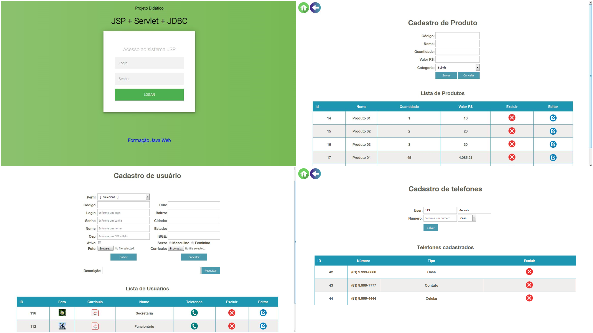

## Servlets com JavaServer Pages e JDBC

###  :desktop_computer: Tela

  

----------

### :hammer_and_wrench: Ferramentas
As seguintes tecnologias foram utilizadas na construção do projeto:
- Servlets e JavaServer Pages;
- JDBC;
- Banco de Dados - PostgreSQL;
- Apache Tomcat;
- Padrão MVC com Java;
- Eclipse.

----------

###  :gear: Funções
- [x] CRUD de Usuários;
- [x] CRUD de Produtos;
- [x] Painel Administrador.

----------

###  :eyeglasses: Autor
José Gustavo da Silva.
[
**Linkedin**
](https://www.linkedin.com/in/jose-gustavo312/)
